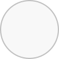
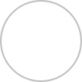

# Designmanual (Under utvikling)

## Logo

### Kvadratisk
### Avlang

## Farger

### Primærfarge

| Farge       | Hex     | Rgb              | Cmyk                |
| ----------- | ------- | ---------------- | ------------------- |
| Rød         | #c93838 | rgb(201, 56, 56) | cmyk(0, 72, 72, 21) |

### Sekundærfarger

| Farge       | Hex     | Rgb                | Cmyk             |
| ----------- | ------- | ------------------ | ---------------- |
| Grå         | #f8f8f8 | rgb(248, 248, 248) | cmyk(0, 0, 0, 3) |

| Farge       | Hex     | Rgb                | Cmyk             |
| ----------- | ------- | ------------------ | ---------------- |
| Hvit        | #ffffff | rgb(255, 255, 255) | cmyk(0, 0, 0, 0) |

| Farge       | Hex     | Rgb          | Cmyk                 |
| ----------- | ------- | ------------ | -------------------- |
| Svart       | #000000 | rgb(0, 0, 0) | cmyk(0, 0, 0, 100)   |

## Font

- Sans serif i overskrifter
- Serif i brødtekst

## Bilder

### Sideforhold

16:10
